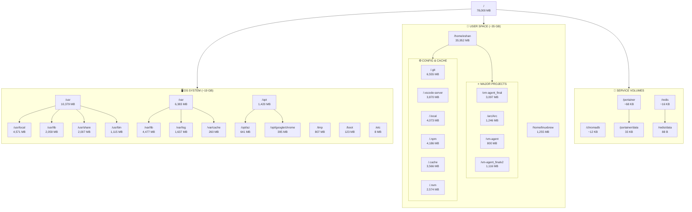

# Filesystem Scan Report
*Generated: 2026-03-29*

## Overview
Total System: **78GB** | Used: **70GB (91%)** | Available: **7.4GB**

---

## Section 1: OS Directories (System)

```
OS Filesystem Structure (in MB)
==============================

/                           [78,000 MB total]
├── bin/                    [0 MB]
├── boot/                   [123 MB]
│   ├── efi/                [1 MB]
│   └── grub/               [11 MB]
├── dev/                    [0 MB]  (virtual)
├── etc/                    [8 MB]
│   ├── apt/                [1 MB]
│   ├── caddy/              [1 MB]
│   ├── initramfs-tools/    [1 MB]
│   ├── redis/              [1 MB]
│   ├── ssh/                [1 MB]
│   └── ssl/                [1 MB]
├── lib/                    [0 MB]
├── lib64/                  [0 MB]
├── lib32/                  [0 MB]
├── libx32/                 [0 MB]
├── opt/                    [1,420 MB]
│   ├── az/                 [641 MB]      (Azure CLI)
│   ├── google/chrome/      [395 MB]      (Chrome)
│   └── signal-cli/         [94 MB]
├── proc/                   [0 MB]  (virtual)
├── root/                   [1 MB]
├── run/                    [0 MB]  (tmpfs)
├── sbin/                   [0 MB]
├── srv/                    [0 MB]
├── sys/                    [0 MB]  (virtual)
├── tmp/                    [807 MB]
├── usr/                    [10,379 MB]
│   ├── bin/                [1,115 MB]
│   ├── lib/                [2,059 MB]
│   ├── local/              [4,571 MB]
│   ├── sbin/               [67 MB]
│   ├── share/              [2,007 MB]
│   └── src/                [312 MB]
└── var/                    [6,383 MB]
    ├── cache/              [260 MB]
    ├── lib/                [4,477 MB]
    ├── log/                [1,637 MB]
    ├── mail/               [1 MB]
    ├── spool/              [1 MB]
    └── tmp/                [1 MB]
```

### OS Summary
| Directory | Size (MB) | Purpose |
|-----------|-----------|---------|
| /usr | 10,379 | System binaries, libraries, documentation |
| /var | 6,383 | Variable data (logs, cache, databases) |
| /opt | 1,420 | Optional add-on packages (Chrome, Azure CLI) |
| /tmp | 807 | Temporary files |
| /boot | 123 | Bootloader files |
| /etc | 8 | System configuration |
| **Total OS** | **~19,120 MB** | |

---

## Section 2: Project/Development Directories

```
Development Filesystem Structure (in MB)
=========================================

/home/                          [35,952 MB total - primary workspace]
├── eshan/                      [35,952 MB]  ← MAIN USER
│   ├── Projects (Top Level):
│   │   ├── arc/Arc/            [1,246 MB]     ★ Arc Platform
│   │   ├── vm-agent_final/     [3,097 MB]     ★ VM Agent Final
│   │   ├── vm-agent/           [800 MB]       ⚡ Active VM Agent
│   │   ├── vm-agent-deep/      [136 MB]
│   │   ├── vm-agent_finalv2/   [1,116 MB]
│   │   └── .git/               [6,555 MB]     (home dir git repo)
│   │
│   ├── AI/ML Frameworks:
│   │   ├── agent-zero/         [1 MB]
│   │   ├── claude-code-agents/ [1 MB]
│   │   ├── smolagents/         [1 MB]
│   │   ├── autogen/            [1 MB]
│   │   ├── pydantic-ai/        [1 MB]
│   │   ├── langfuse/           [1 MB]
│   │   ├── semantic-kernel/    [1 MB]
│   │   ├── cognee/             [1 MB]
│   │   ├── composio/           [1 MB]
│   │   ├── browser-use/        [1 MB]
│   │   └── llama-agents/       [1 MB]
│   │
│   ├── Cloned Repos:
│   │   ├── CopilotKit/         [1 MB]
│   │   ├── LibreChat/          [1 MB]
│   │   ├── MetaGPT/            [1 MB]
│   │   ├── OpenHands/          [1 MB]
│   │   ├── SWE-bench/          [1 MB]
│   │   ├── SWE-smith/          [1 MB]
│   │   ├── SWE-agent/          [1 MB]
│   │   ├── aider/              [1 MB]
│   │   ├── cline/              [1 MB]
│   │   ├── anthropic-*/        [2 MB total]
│   │   ├── openai-*/           [2 MB total]
│   │   ├── open-interpreter/   [1 MB]
│   │   └── mini-swe-agent/     [1 MB]
│   │
│   ├── Node.js Projects:
│   │   ├── agent-portal/       [1 MB]
│   │   ├── openclaw/           [240 MB]
│   │   ├── tui-inbox/          [1 MB]
│   │   ├── openrouter/         [26 MB]
│   │   ├── copilot-agent-builder/  [1 MB]
│   │   ├── awesome_copilot/    [13 MB]
│   │   ├── portal/             [1 MB]
│   │   ├── prototype_portal/   [75 MB]
│   │   ├── portal_archive/     [389 MB]
│   │   ├── enhanced_portal/    [385 MB]
│   │   └── copilot-agent-ui/   [167 MB]
│   │
│   ├── Config/Tooling:
│   │   ├── .cache/             [3,566 MB]   (heavy cache usage)
│   │   ├── .vscode-server/     [3,870 MB]   (VS Code remote)
│   │   ├── .local/             [4,073 MB]
│   │   ├── .nvm/               [2,574 MB]   (Node versions)
│   │   ├── .npm/               [4,186 MB]   (npm cache)
│   │   ├── .git/               [6,555 MB]
│   │   ├── .agents/            [17 MB]
│   │   ├── .cursor/            [29 MB]
│   │   ├── .cursor-server/     [1,409 MB]
│   │   ├── .copilot/           [321 MB]
│   │   ├── .claude/            [2 MB]
│   │   ├── .continue/          [10 MB]
│   │   ├── .gemini/            [21 MB]
│   │   ├── .amp/               [107 MB]
│   │   ├── .antigravity-server/[411 MB]
│   │   ├── .codex/             [171 MB]
│   │   ├── .agent-browser/     [371 MB]
│   │   └── .mem0/              [1 MB]
│   │
│   └── Misc:
│       ├── .ssh/               [1 MB]
│       ├── go/                 [99 MB]
│       ├── .net/               [74 MB]
│       ├── uploads/            [1 MB]
│       ├── temp/               [1 MB]
│       ├── docs/               [1 MB]
│       ├── extraction_docs/    [89 MB]
│       └── schematic_work/     [6 MB]
│
├── linuxbrew/                  [1,255 MB]     (Homebrew packages)
│   └── .linuxbrew/
│       ├── bin/                [14 MB]
│       ├── Cellar/             [778 MB]
│       ├── lib/                [1 MB]
│       └── share/              [42 MB]
│
└── ubuntu/                     [1 MB]
    └── .ssh/
```

### Development Summary
| Directory | Size (MB) | Purpose |
|-----------|-----------|---------|
| /home/eshan/.git | 6,555 | Git repository for home directory |
| /home/eshan/.local | 4,073 | Local apps and data |
| /home/eshan/.npm | 4,186 | npm package cache |
| /home/eshan/.cache | 3,566 | Application caches |
| /home/eshan/.vscode-server | 3,870 | VS Code remote server |
| /home/eshan/vm-agent_final | 3,097 | CV/ML Annotation Tool |
| /home/eshan/.nvm | 2,574 | Node Version Manager |
| /home/eshan/arc/Arc | 1,246 | Arc Platform (React + FastAPI) |
| /home/eshan/.cursor-server | 1,409 | Cursor IDE server |
| /home/eshan | 35,952 | **Total user workspace** |
| /home/linuxbrew | 1,255 | Package manager |
| **Total Dev** | **~37,000 MB** | |

---

## Section 3: Filesystem Visualization (Mermaid)



---

## Disk Usage Analysis

### Top 10 Largest Directories

| Rank | Directory | Size (MB) | % of Total |
|------|-----------|-----------|------------|
| 1 | /home/eshan/.git | 6,555 | 8.4% |
| 2 | /home/eshan/.vscode-server | 3,870 | 5.0% |
| 3 | /home/eshan/.local | 4,073 | 5.2% |
| 4 | /home/eshan/.npm | 4,186 | 5.4% |
| 5 | /home/eshan/.cache | 3,566 | 4.6% |
| 6 | /home/eshan/.nvm | 2,574 | 3.3% |
| 7 | /home/eshan/vm-agent_final | 3,097 | 4.0% |
| 8 | /home/eshan | 35,952 | 46.1% |
| 9 | /usr | 10,379 | 13.3% |
| 10 | /var | 6,383 | 8.2% |

### Space Breakdown

```
Total Disk: 78 GB
├─ OS/System Base:  ~8 GB
├─ /usr packages:   ~10 GB
├─ Development Tools: ~25 GB
├─ Project Files:    ~8 GB
├─ Cache/Temp:       ~10 GB
└─ Git Repositories: ~7 GB

⚠️ WARNING: 91% full (only 7.4 GB remaining)
```

### Cleanup Recommendations

**High Impact (~15+ GB potential):**
1. `/home/eshan/.cache/` - 3.5 GB (old build caches)
2. `/home/eshan/.npm/` - 4.1 GB (npm package cache)
3. `/home/eshan/.nvm/.cache/` - Check for old Node versions
4. `/var/log/` - 1.6 GB (rotate logs)
5. `/home/eshan/arc/Arc/frontend/.next/` - 243 MB (build cache)
6. Docker images/containers (if present)

**Medium Impact (~5 GB potential):**
1. `/home/eshan/.vscode-server/` - 3.8 GB (old extensions)
2. `/home/eshan/.cursor-server/` - 1.4 GB
3. `/home/eshan/arc/Arc/frontend/node_modules/` - 763 MB

**Safe to Clean:**
- `/tmp/` - 807 MB
- `/var/cache/apt/` - 260 MB
- Build artifacts in `.next/`, `__pycache__/`, etc.

---

## Key Paths Quick Reference

### Active Development:
- **Arc Platform**: `/home/eshan/arc/Arc/`
  - Frontend: `./frontend/`
  - Backend: `./backend/`
  - Memory: `./workspace/memories/`
- **VM Agent Final**: `/home/eshan/vm-agent_final/`
- **VM Agent Active**: `/home/eshan/vm-agent/`

### Configs:
- System: `/etc/`
- User: `/home/eshan/.config/`
- SSH: `/home/eshan/.ssh/`
- Project conventions: `/home/eshan/arc/Arc/workspace/memories/`

### Services:
- Portainer: `/portainer/data/` (33 KB)
- Redis: `/redis/data/dump.rdb` (88 B)
- ChromaDB: `/chromadb/` (containerized)

### Tools:
- UV: `/home/eshan/.local/bin/uv`
- NPM: `/home/eshan/.nvm/`
- Homebrew: `/home/linuxbrew/.linuxbrew/`

---

*Report generated: 2026-03-29*
*Disk status: ⚠️ HIGH USAGE (91% full)*
